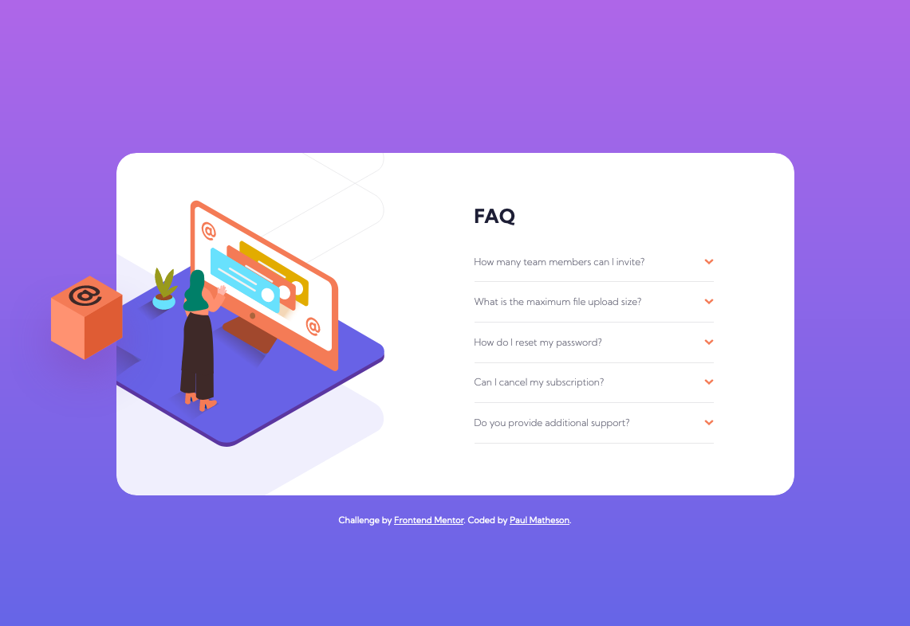

# Frontend Mentor - FAQ accordion card solution

This is a solution to the [FAQ accordion card challenge on Frontend Mentor](https://www.frontendmentor.io/challenges/faq-accordion-card-XlyjD0Oam). Frontend Mentor challenges help you improve your coding skills by building realistic projects. 

## Table of contents

- [Overview](#overview)
  - [The challenge](#the-challenge)
  - [Screenshot](#screenshot)
  - [Links](#links)
- [My process](#my-process)
  - [Built with](#built-with)
  - [What I learned](#what-i-learned)
  - [Useful resources](#useful-resources)
- [Author](#author)

## Overview

### The challenge

Users should be able to:

- View the optimal layout for the component depending on their device's screen size
- See hover states for all interactive elements on the page
- Hide/Show the answer to a question when the question is clicked

### Screenshot



### Links

- Solution URL: [Link](https://your-solution-url.com)
- Live Site URL: [Link](https://your-live-site-url.com)

## My process

### Built with

- Semantic HTML5 markup
- CSS & Flexbox
- Flexbox
- CSS Grid
- JavaScript
- Mobile-first workflow

### What I learned

This was my first time using the CSS property "clip path" below. My first attempt to position the images was by using absolute positioning and to hide any overflow. Unfortunately, you can't hide the overflow on an absolute positioned element because it is taken out of the document flow. Using "clip path" allowed me to position these elements more freely and hide any overflow.

For example:

```css
.container {
  clip-path: inset(0 0 0 0 round 25px);
}
```

### Useful resources

- [clip-path documentation](https://developer.mozilla.org/en-US/docs/Web/CSS/clip-path) 

## Author

- Website - [Paul Matheson](https://www.paulmatheson.net)
- Frontend Mentor - [@paulmatheson](https://www.frontendmentor.io/profile/paulmatheson)
