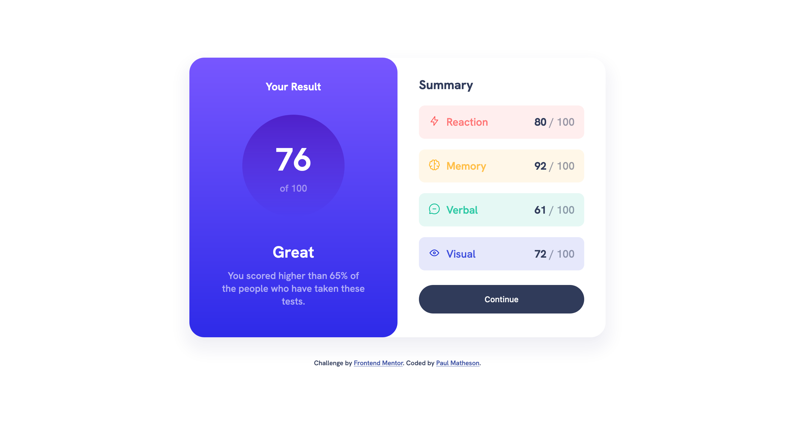

# Frontend Mentor - Results summary component solution

This is a solution to the [Results summary component challenge on Frontend Mentor](https://www.frontendmentor.io/challenges/results-summary-component-CE_K6s0maV). Frontend Mentor challenges help you improve your coding skills by building realistic projects. 

## Table of contents

- [Overview](#overview)
  - [The challenge](#the-challenge)
  - [Screenshot](#screenshot)
  - [Links](#links)
- [My process](#my-process)
  - [Built with](#built-with)
- [Author](#author)

## Overview

### The challenge

My challenge was to build out this results summary component and get it looking as close to the design as possible.

Users should be able to:

- View the optimal layout for the interface depending on their device's screen size
- See hover and focus states for all interactive elements on the page

### Screenshot

### Links

- Solution URL: [Link](https://www.frontendmentor.io/solutions/results-summary-component-6XFbNN5B_L)
- Live Site URL: [Link](https://sensational-selkie-35bd88.netlify.app/)

## My process

### Built with

- Semantic HTML5 markup
- CSS custom properties
- Flexbox
- CSS Grid

## Author

- Website - [Paul Matheson](https://www.paulmatheson.net)
- Frontend Mentor - [@paulmatheson](https://www.frontendmentor.io/profile/paulmatheson)
